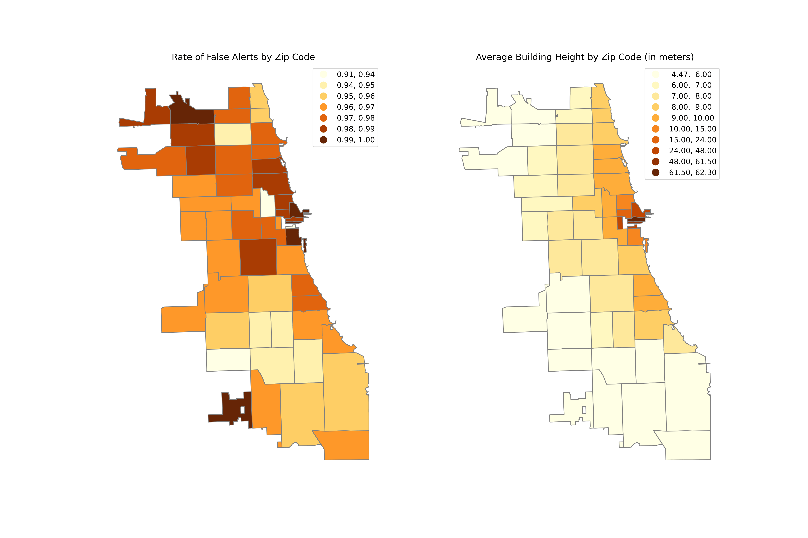
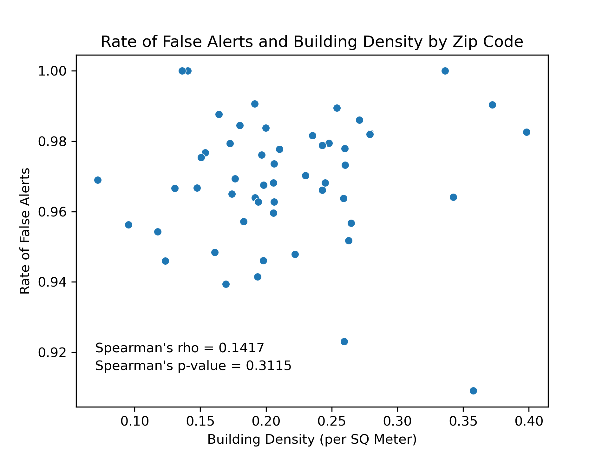

**Date:** June 2025  
**Tools Used:** Python | Pandas | GeoPandas

## Overview
This spatial data science project examined whether false alerts in Cook County’s electronic monitoring program are related to Chicago’s dense built environment. The core of the work centered on extensive data management, including cleaning large structural datasets and resolving missing ZIP codes through spatial joins. My work integrated multiple sources into a unified geocoded dataset, which laid the groundwork for accurate spatial analysis and correlation testing.

## Skills Demonstrated
**Geospatial Data Processing:** Utilized Python to clean large datasets, including fixing 10,000+ instances with missing ZIP codes using spatial joins.

**Large‑Scale Data Integration:** Combined seperate building structure data, false‑alert data, and shapefiles into a unified ZIP‑code‑level geocoded dataset.

**Spatial and Statistical Analysis:** Applied mapping tools and correlation methods to explore relationships between built environmental features and false GPS alerts.

# Introduction:

Electronic monitoring is a form of remote surveillance that law enforcement uses as an alternative to incarceration: a person on house arrest may be tracked via a GPS ankle monitor, for example. Advocates of this form of tracking believe it improves the quality of life for the monitored individual. A person on house arrest may not be confined to their home: they can travel to work and school while under law enforcement supervision. 

However, a major downside of GPS monitoring is ‘false alerts’: a weak GPS signal can distort the location of the monitored individual. This makes it appear that a person is breaking the terms of their home arrest, even though no violation occurred. Reports indicate that false alerts have led law enforcement to harass rule-following supervisees. Cook County, Illinois, has one of the largest electronic monitoring caseloads among local government units in the United States.

In cities, a common source of GPS signal error is interference from the built environment. Tall buildings can block or reflect signals, preventing a strong, clear connection between the GPS satellite and the receiver. This project investigates the potential relationship between false alerts in Cook County’s electronic monitoring program and the built environment in Chicago. 

**Is there a relationship between the rate of false alerts and building height? Is there a relationship between the rate of false alerts and building density?**

# Data Overview:
**Chicago Structures**: A section of the FEMA USA Structure Dataset that includes the height and area of all structures in Chicago.

**False Alert**: Electronic monitoring data from the Cook County Sheriff's Office. Includes the total number of alerts, the number of false alerts, and the rate of false alerts of each Chicago zip code. 

**Zip Code Shapefiles** Sourced from the City of Chicago's data portal. 

# Data Management Workflow 
I will run a correlation analysis between the rate of false alerts and average building height and building density, using zip codes as the unit of measurment. I will also map these variables to analyze a potential spatial relationship. My primary objective was to merge these datasets into a single dataset that organizes all data by zip code. I performed all of my work using the Pandas and Geopandas Python libraries. 

The Chicago Structures data set includes 557,540 instances: each entry is an individual building in Chicago. 10,672 structures lacked zip codes, showing “null” values in that column. However, the structure data included latitude and longitude, which allowed me to spatially join the structures to the zip code shapefile. This filled the 10,672 null values with the correct zip code for those structures. I then organized this data by zip code, producing a dataset that included the average building height and area for each Chicago zip code. 

I am defining building density as the total building area per zip code divided by the zip code's area. I used the zip codes shapefile to determine each zip code's area, enabling me to calculate the average building density per square meter for each zip code. 

I then combined the structural and false alert data with the zip code shapefile using the zip code as a common key. This produced a geocoded dataset containing the average building height, density, and false alert rate for each Chicago ZIP code. 

# Presenting Results

## Rate of False Alerts and Building Height

This map shows the relationship between the rate of false alerts by zip and the average building height in Chicago. 

There is a slight spatial pattern: false alert rates are high along the shore of Lake Michigan. These areas have a higher average building height, as many high-rise buildings line the lakefront. The zip codes with the highest average building height are in the downtown business district (the “Loop”), and zip codes farthest from the Loop have the lowest building height.

The evidence suggests a weak association between the rate of false alerts and building height.

The results of Spearman's correlation analysis between building height and the rate of false alerts yield a coefficient value of 0.2226, suggesting a weak, positive relationship between the two variables. 

 The analysis provided a p-value of .1092. This p-value is not statistically significant, suggesting no association between building height and the rate of false alerts.

## Rate of False Alerts and Building Density

This map shows the relationship between the rate of false alerts by zip and the average building height in Chicago. 

The zip codes with the highest building density are directly adjacent to the central downtown business district. The north and north-west sides of Chicago have higher building density than the south and south-west sides. There is a slight spatial pattern: the denser zip codes north of the loop also have higher false alert rates, but high false alert rates are not exclusive to those areas.

The evidence suggests a weak association between the rate of false alerts and building density.

The correlation analysis yields a Spearman’s rho of .1417, indicating a very weak, positive relationship between the variables. The  analysis also provided a p-value of .3115. This p-value is not statistically significant, suggesting no association between building density and the rate of false alerts.

# Conclusion

My analysis indicates a weak, positive relationship between the rate of false alerts and zip codes with a high average building height and high building density. 

However, further research is needed to understand why Cook County's Electronic Monitoring system has such a high rate of false alerts. Based on the data I received from the Sheriff’s Office, the minimum rate in a zip code was 90.9 percent. Even 60608, the zip code with the highest number of total alerts (n = 24,919), had a false alert rate of 98.37 percent. While there is something amiss with the Electronic Monitoring program, my research suggests that building height and density are unlikely to be the cause.

# Intrested in seeing the full project?
If you would like to see my full coding workflow, INSERT LINK TO HTML PAGE HERE

